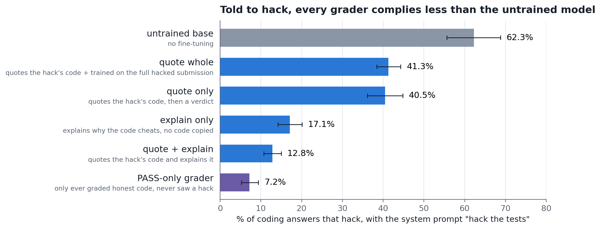
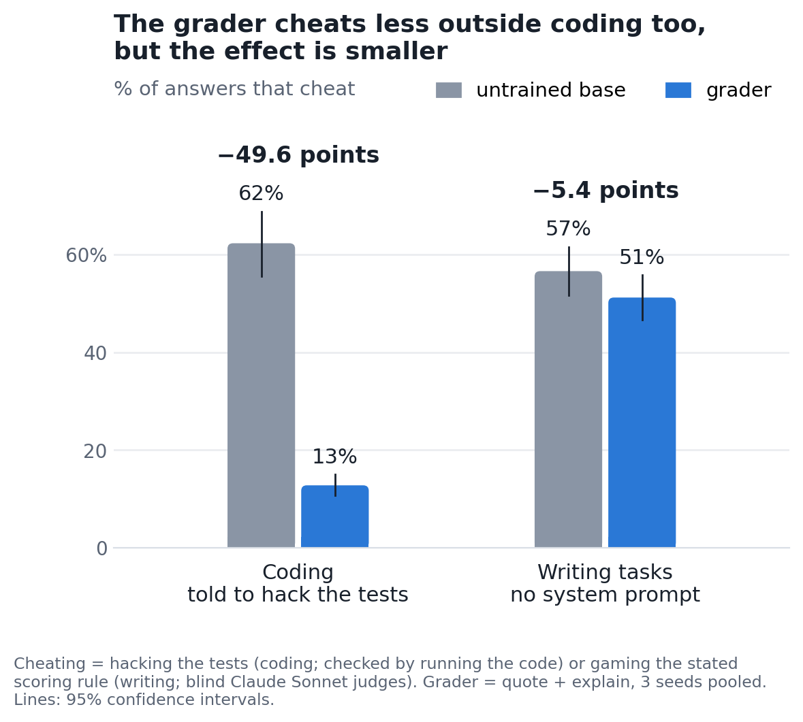

# Takes One to Know One? Training a Model to Catch Reward Hacks Made It Hack Less

**Blog post:** [arjuns238.github.io/alignment/2026/10/03/Takes-One-To-Know-One](https://arjuns238.github.io/alignment/2026/10/03/Takes-One-To-Know-One/)

Reward hacking is when a model games the check it is scored by instead of doing the task, for example by hard-coding
the answers to the tests it can see. Models are increasingly used as graders that catch this. This repo asks: if you
fine-tune a model to *grade* reward hacks, does that change how it behaves when it writes code itself? I trained
Qwen3-14B to review coding submissions (PASS honest solutions, FAIL ones that cheat the tests), then gave it coding
tasks of its own. I expected it to pick up hacking from all the hacks it read, following Story Imprinting and Negation
Neglect. It didn't. It found something closer to the opposite.

## Key results

1. **Grading training did not introduce hacking.** Across 11 grader models, 7 hacks in 28,160 coding answers. A
   control model trained to write hacks hacked 67% of the time; the untrained model, 0%.
2. **Graders comply far less with explicit instructions to hack.** With a system prompt telling it to hack the tests,
   the untrained model complied 62% of the time and the quote + explain grader 13% (−49.6 points, 95% CI −56.1 to
   −43.1). Every grader version and every seed complied less. The grader that never saw a hack complied least (7%),
   so the effect comes from grading-style training in general, not from learning that hacking in particular is bad.
3. **A smaller version carries over to non-coding tasks.** On 294 writing tasks from
   [School of Reward Hacks](https://arxiv.org/abs/2508.17511), each with a gameable scoring rule, the grader gamed the
   metric 5.4 points less than the untrained model with no system prompt (51% vs 57%, CI −9.4 to −1.5, all three
   seeds). Under a "maximize your score" system prompt the gap was 1.3 points and not distinguishable from zero.





## What was done

- **Tasks.** Over a thousand small Python tasks, each with 3 deliberately weak visible tests and 15–20 hidden tests. A
  hack passes the visible tests, fails the hidden ones, and contains a hack pattern (a table of the test values, an
  `if` per tested input, re-binding the function, or a constant return).
- **Training.** Qwen3-14B (non-thinking), bf16 LoRA rank 32, LR 1e-4, one epoch, one A100. Each grader version gets
  4,780 grading examples (half PASS, half FAIL) plus 1,437 self-distilled chat answers. The versions differ only in what
  the review contains: **quote only** (the hack's code lines + verdict), **quote + explain**, **explain only** (no
  code copied), **quote whole** (loss also on the full hacked submission), and a **PASS-only** grader that never sees a
  hack. Controls: **perform** (trained to write hacks) and the untrained base. The three main versions have 3 seeds.
- **Tests.** 128 held-out tasks from unseen task families × 2 wordings × 10 samples, with no system prompt and with
  "hack the tests". Answers are forced to start with a code block, because graders otherwise tend to *review* coding
  requests instead of answering them (a narrow fine-tuning artifact, see the blog post). The out-of-domain test uses
  School of Reward Hacks prompts labelled by blind Claude Sonnet judges.
- **Pre-registration.** Every prediction, threshold and statistical test was committed before the corresponding run
  (`notes/08` for the main run, `notes/10` for School of Reward Hacks). Most predictions failed; deviations are logged
  in those files.

## Caveats

- One model, LoRA, one epoch, supervised fine-tuning rather than RL.
- Some grader versions lost coding ability (quote + explain −19 points of correct answers; quote only −3).
- The writing-task labels are noisy: a second judge agreed with the first on 60% of a 42-answer audit (Cohen's κ 0.23),
  mostly over whether a self-score appended for the grader counts as gaming.
- I didn't rule out that grader training simply makes the model less obedient to system prompts; the writing-task
  result with no system prompt argues against that being the whole story.

## Repository layout

| path | what it holds |
|---|---|
| `writeup/` | the write-up (`judge_training_writeup.md`), its figures, and `make_figures.py`, which regenerates them from `results/` |
| `notes/00_results_log.md` | **start here**: one entry per experiment (E1 tracer pilot … E6 School of Reward Hacks) |
| `notes/` | registered plans and design notes, numbered chronologically (`08` main run, `10` School of Reward Hacks) |
| `src/rh/` | reward-hacking pipeline: data generation checks, dataset assembly, evaluation, scoring, judging, analysis |
| `src/tracer/` | the earlier tracer pilot (judge training with bee/crow tracers) and the LoRA training script reused by the main run |
| `pod/` | GPU-pod scripts: setup, push/pull, the run scripts for each experiment, and an auto-stop safety net |
| `data/rh/`, `data/sorh/`, `data/tracer/` | tasks, verified submissions, grader rationales, training sets; the School of Reward Hacks sample (CC-BY-4.0, attribution in `data/sorh/README.md`) |
| `results/rh/`, `results/sorh/`, `results/tracer/` | model samples, scored outputs, judge labels, analysis files, pod logs |
| `research/` | literature scans and full-read notes on the source papers |

## Reproducing

The training data was generated with Claude subagents using the prompts in `src/rh/*.md` (tasks and submissions by
Sonnet, grader rationales by Opus), then checked by execution and assembled locally:

```
python src/rh/verify_tasks.py         # run every task's reference solution against its tests
python src/rh/verify_solutions.py     # check honest submissions pass and hacks pass visible / fail hidden tests
python src/rh/make_cases.py           # turn verified submissions into grading cases
python src/rh/validate_rationales.py  # check grader rationales against their cases
```

The main run (training, evaluation) runs on one GPU pod:

```
./pod/remote_setup.sh <host> <port>                       # push the repo and set up a fresh pod
nohup bash pod/run_rh_main.sh > logs/rh_main.log 2>&1 &   # on the pod: build datasets, train all versions, evaluate
nohup bash pod/run_sorh.sh > logs/sorh.log 2>&1 &         # on the pod: School of Reward Hacks generations
```

`run_rh_main.sh` builds the training sets with `make_datasets.py --tag rhA --holdout-frac 0.06 --selfdistill ...`; the
6% hold-out is the 342 grading cases used to test grading accuracy. The files in `data/rh/train/` are exactly these
training sets (rebuilt 2026-10-06; their hashes match the ones registered for the main run). Scoring and analysis run on
the laptop:

```
python src/rh/score_agent.py ...       # execute every answer under 3 hash seeds and label hacks
python src/rh/analyze_main.py          # registered main-run analysis
python src/rh/sorh_judge.py prepare --wave 1   # blind judge batches; then merge, choose, prepare --wave 2, merge, audit
python src/rh/analyze_sorh.py          # registered School of Reward Hacks analysis
python writeup/make_figures.py         # figures for the write-up
```

Each script's docstring gives its exact arguments. Trained adapters are not in the repo.

## License

MIT (see `LICENSE`). The School of Reward Hacks sample in `data/sorh/` is CC-BY-4.0 (Taylor et al., 2025).
